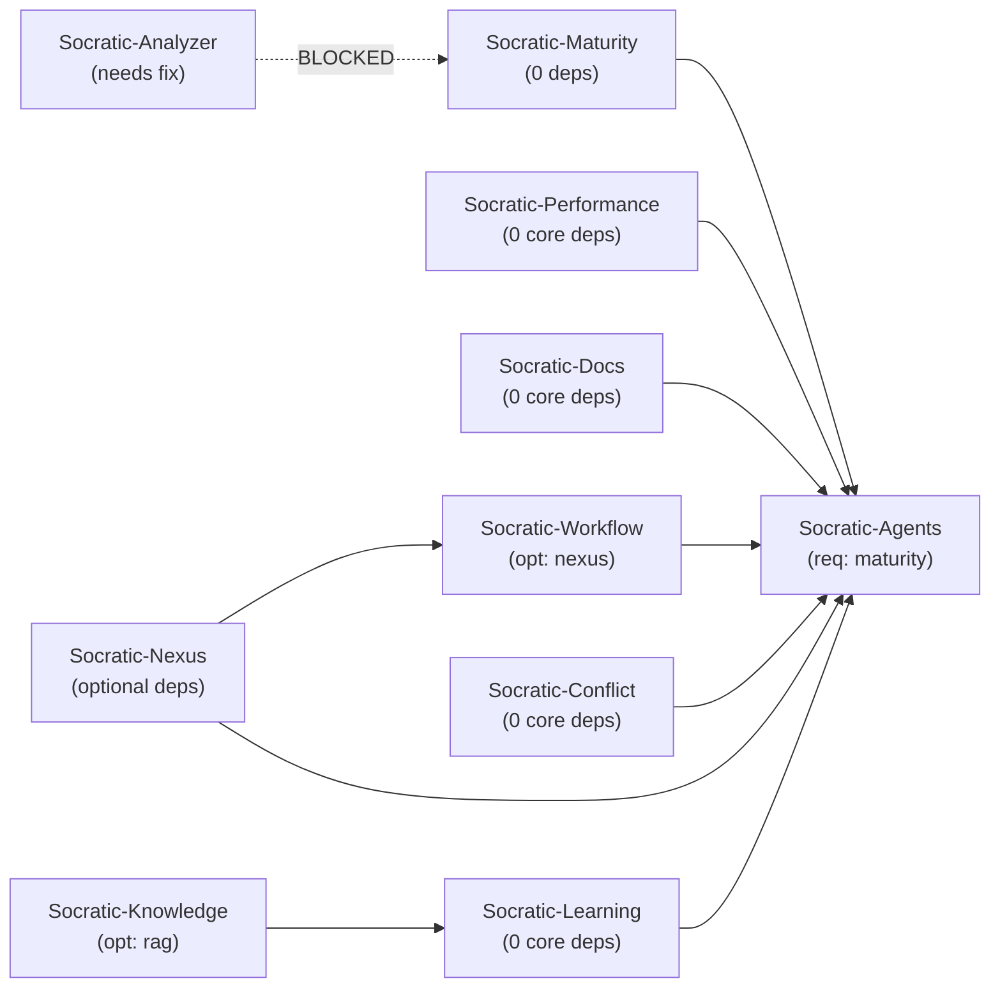

# SOCRATIC LIBRARIES - PUBLICATION ACTION PLAN
## Complete Roadmap for PyPI Publication & Integration

---

## IMMEDIATE ACTIONS (This Week)

### 1. CRITICAL: Resolve Socratic-Analyzer Blocker
**Priority:** 🔴 BLOCKING ALL PROGRESS
**Time Estimate:** 1-2 days
**Status:** ⏳ PENDING

**Issue:** 16 unresolved imports from socratic_system

**Decision Point - Choose ONE approach:**

#### Option A: Extract Missing Modules into Library (Recommended)
```
Timeline: 2-3 days
Steps:
1. Copy the following from Socrates monolith into socratic-analyzer:
   - project_categories.py (get_phase_categories function)
   - insight_categorizer.py (InsightCategorizer class)
   - validators/* (DependencyValidator, SyntaxValidator, TestExecutor)
   - workflow_*.py (cost/path/risk calculators)
   - models/project.py subset (ProjectContext, ConflictInfo, CategoryScore, PhaseMaturity)

2. Update all imports in socratic-analyzer to use local modules
3. Add comprehensive tests for extracted modules
4. Add to __init__.py exports
5. Update pyproject.toml with clear descriptions
```

#### Option B: Convert to Socrates-Only Plugin
```
Timeline: 1 day
Steps:
1. Add to Socrates pyproject.toml as internal module (not published)
2. Keep in separate directory but ship with Socrates
3. Update documentation as "internal only"
```

#### Option C: Complete Redesign (Not Recommended)
```
Timeline: 3-5 days
Too complex for the scope
```

**Recommendation:** Option A - Extract modules. Gives most flexibility.

**Assigned To:** [User decision on approach]

---

### 2. Add Missing LICENSE Files
**Priority:** 🟠 HIGH
**Time Estimate:** 30 minutes
**Status:** ⏳ PENDING

**Files to update:**
- [ ] Socratic-nexus/LICENSE (MIT)
- [ ] Socratic-maturity/LICENSE (MIT)

**Action:**
```bash
# Add standard MIT license file to both repos
# Update MANIFEST.in to include LICENSE
```

---

### 3. Socratic-Agents Test Suite Expansion
**Priority:** 🟠 HIGH
**Time Estimate:** 1-2 days
**Status:** ✅ PARTIALLY DONE (28 tests, need 50+)

**Current Status:** 28 tests passing
**Target:** 50+ tests covering all agents

**Missing Tests:**
- [ ] ProjectManagerAgent comprehensive tests (5+ tests)
- [ ] UserManagerAgent comprehensive tests (5+ tests)
- [ ] SystemMonitorAgent tests (5+ tests)
- [ ] DocumentProcessorAgent tests (5+ tests)
- [ ] ContextAnalyzerAgent tests (5+ tests)
- [ ] Async/concurrent agent tests (3+ tests)
- [ ] Cross-agent communication tests (3+ tests)
- [ ] Error handling and edge cases (5+ tests)

**Action:**
```bash
cd /c/Users/themi/PycharmProjects/Socratic-agents
# Expand tests/test_core_agents.py with 20+ more test cases
pytest tests/ -v --cov=src/socratic_agents
```

---

## PHASE 1: FOUNDATION LIBRARIES (Week 1-2)

### 1. Publish Socratic-Maturity
**Status:** ✅ READY
**Score:** 92/100
**Timeline:** 1 day

**Pre-Publication Checklist:**
- [ ] Add LICENSE file (MIT)
- [ ] Verify tests pass
- [ ] Run final linting (black, ruff, mypy)
- [ ] Check version in pyproject.toml: 0.1.0
- [ ] Verify __all__ exports all public classes
- [ ] Create PyPI account if needed
- [ ] Build distribution: `python -m build`
- [ ] Test with twine: `twine check dist/*`
- [ ] Publish: `twine upload dist/*`

**Post-Publication:**
- [ ] Update Socrates requirements to use `socratic-maturity>=0.1.0`
- [ ] Test import in Socrates: `from socratic_maturity import MaturityCalculator`
- [ ] Create GitHub release tag v0.1.0

---

### 2. Publish Socratic-Nexus
**Status:** ✅ READY
**Score:** 92/100
**Timeline:** 1 day

**Pre-Publication Checklist:**
- [ ] Add LICENSE file (MIT)
- [ ] Verify all 59 tests pass
- [ ] Run final linting
- [ ] Check version in pyproject.toml: 0.3.6
- [ ] Verify py.typed marker exists
- [ ] Build & test
- [ ] Publish to PyPI

**Post-Publication:**
- [ ] Update Socrates requirements
- [ ] Test import in Socrates: `from socratic_nexus import ClaudeClient`
- [ ] Create GitHub release tag v0.3.6

---

## PHASE 2: UTILITY LIBRARIES (Week 2-3)

### 3. Prepare Socratic-Performance
**Status:** ✅ READY
**Score:** 85/100
**Timeline:** 1 day

**Pre-Publication Tasks:**
- [ ] Expand test coverage (add 5+ more test cases)
- [ ] Expand __all__ exports to include all public classes
- [ ] Update documentation/docstrings
- [ ] Run linting
- [ ] Check version: 0.1.1
- [ ] Build & verify
- [ ] Publish to PyPI

---

### 4. Prepare Socratic-Docs
**Status:** ✅ READY
**Score:** 80/100
**Timeline:** 1 day

**Pre-Publication Tasks:**
- [ ] Expand __all__ to export: ArtifactSaver, DocumentationGenerator, CodeExtractor, etc.
- [ ] Add 3-5 more test cases
- [ ] Update docstrings
- [ ] Run linting
- [ ] Check version: 0.2.0
- [ ] Build & verify
- [ ] Publish to PyPI

---

### 5. Prepare Socratic-Learning
**Status:** ✅ READY
**Score:** 85/100
**Timeline:** 1 day

**Pre-Publication Tasks:**
- [ ] Expand __all__ to export more classes (pattern models, etc.)
- [ ] Add 5+ comprehensive test cases
- [ ] Update documentation
- [ ] Verify optional imports (agents, rag, workflow) work correctly
- [ ] Check version: 0.1.5
- [ ] Build & verify
- [ ] Publish to PyPI

---

### 6. Publish Socratic-Conflict
**Status:** ✅ READY
**Score:** 90/100
**Timeline:** 1 day

**Pre-Publication Tasks:**
- [ ] Verify all 8 tests pass
- [ ] Run linting
- [ ] Check version: 0.1.2
- [ ] Verify optional dependencies (agents, workflow) properly declared
- [ ] Build & verify
- [ ] Publish to PyPI

---

## PHASE 3: HIGHER-LEVEL LIBRARIES (Week 3-4)

### 7. Publish Socratic-Workflow
**Status:** ✅ READY
**Score:** 87/100
**Timeline:** 1 day

**Pre-Publication Tasks:**
- [ ] Verify all 11 tests pass
- [ ] Verify WorkflowTemplate and WorkflowTemplateLibrary fully implemented
- [ ] Check CostTracker integration
- [ ] Check version: 0.1.1
- [ ] Run linting
- [ ] Build & verify
- [ ] Publish to PyPI

---

### 8. Publish Socratic-Knowledge
**Status:** ✅ READY
**Score:** 90/100
**Timeline:** 1 day

**Pre-Publication Tasks:**
- [ ] Verify all 11 tests pass
- [ ] Verify multi-tenant isolation is robust
- [ ] Verify RBAC implementation is production-ready
- [ ] Check version: 0.1.4
- [ ] Run linting
- [ ] Build & verify
- [ ] Publish to PyPI

---

## PHASE 4: ORCHESTRATION LIBRARIES (Week 4-5)

### 9. Complete & Publish Socratic-Agents
**Status:** ⚠️ BLOCKED (Incomplete)
**Score:** 72/100
**Timeline:** 2-3 days

**Critical Tasks:**
- [ ] Expand test suite to 50+ tests (currently 28)
- [ ] Complete agent implementations (verify no stubs remain)
- [ ] Add proper error handling for missing orchestrator attributes
- [ ] Document AgentOrchestrator interface formally
- [ ] Verify orchestrator matches Socrates expectations
- [ ] Create integration tests with other libraries
- [ ] Check version: 0.1.0 → consider 0.2.0 for breaking changes?
- [ ] Run comprehensive testing
- [ ] Build & verify
- [ ] Publish to PyPI

**Post-Publication:**
- [ ] Update Socrates to use published version
- [ ] Test integration with all other libraries
- [ ] Create GitHub release tag v0.1.0 (or v0.2.0)

---

## PHASE 5: BLOCKED LIBRARIES (Week 5+)

### 10. Resolve Socratic-Analyzer
**Status:** 🚨 BLOCKED
**Score:** 25/100
**Timeline:** 3-5 days (depends on approach)

**Decision Required:**
- [ ] Choose Option A, B, or C (see "Immediate Actions" above)
- [ ] Implement chosen approach
- [ ] Add comprehensive tests
- [ ] Verify all imports resolve
- [ ] Update docstrings
- [ ] Build & verify
- [ ] Publish to PyPI

**Note:** Do NOT proceed with this library until decision is made and 16 imports are resolved.

---

## PARALLEL TASKS (Can be done while publishing)

### Create Compatibility Layer in Socrates
**Timeline:** 2 days
**Responsible:** Parallel with Phase 1-2

```python
# In Socrates main __init__.py or compat module:

try:
    from socratic_maturity import MaturityCalculator
    MATURITY_CALCULATOR = MaturityCalculator
except ImportError:
    MATURITY_CALCULATOR = None

try:
    from socratic_nexus import ClaudeClient
    CLAUDE_CLIENT = ClaudeClient
except ImportError:
    CLAUDE_CLIENT = None

# ... etc for all libraries
```

**Tasks:**
- [ ] Create `socratic_system/compat.py` for imports
- [ ] Add compatibility wrappers where needed
- [ ] Update main Socrates to use published libraries
- [ ] Test import chain
- [ ] Verify backwards compatibility

---

### Create Integration Tests
**Timeline:** 3 days
**Responsible:** After Phase 1 completion

**Tests to create:**
- [ ] Cross-library import tests (agents + nexus + maturity)
- [ ] Orchestration tests (agents + knowledge + workflow)
- [ ] Client tests (nexus with other agents)
- [ ] End-to-end Socrates test with all libraries

---

### Update Documentation
**Timeline:** 2 days
**Responsible:** Parallel with publication

**Documents to create:**
- [ ] Installation guide for each library
- [ ] Quick start guides
- [ ] API reference for each library
- [ ] Integration guide for main Socrates
- [ ] Migration guide from monolith imports
- [ ] Troubleshooting guide

---

## PUBLICATION TIMELINE SUMMARY

```
Week 1:
  Day 1: Resolve Socratic-Analyzer decision (Option A/B/C)
  Day 2: Add LICENSE files + expand agents tests
  Day 3: Publish Socratic-Maturity + Socratic-Nexus
  Day 4: Complete Phase 1 validation

Week 2:
  Day 1: Publish Socratic-Performance
  Day 2: Publish Socratic-Docs
  Day 3: Publish Socratic-Learning
  Day 4: Publish Socratic-Conflict
  Day 5: Phase 2 validation + compat layer creation

Week 3:
  Day 1: Publish Socratic-Workflow
  Day 2: Publish Socratic-Knowledge
  Day 3: Phase 3 validation
  Day 4-5: Integration testing + documentation

Week 4:
  Day 1-3: Complete Socratic-Agents + expand tests
  Day 4: Publish Socratic-Agents
  Day 5: Phase 4 validation

Week 5+:
  Handle Socratic-Analyzer based on chosen approach
```

---

## SUCCESS CRITERIA

### For Each Library (Before Publishing):
- [ ] All tests pass
- [ ] Linting passes (black, ruff, mypy)
- [ ] No unresolved imports from socratic_system
- [ ] API properly exported in __init__.py
- [ ] LICENSE file present
- [ ] Version number consistent
- [ ] README.md updated
- [ ] pyproject.toml dependencies correct

### For Overall Project (After Publishing):
- [ ] All 10 libraries available on PyPI
- [ ] Main Socrates imports from published libraries
- [ ] Backwards compatibility maintained
- [ ] All integration tests pass
- [ ] Users can install Socrates without monolith code
- [ ] Clear migration path documented

---

## RISK MITIGATION

### Risk: Version Conflicts
**Mitigation:**
- Use strict version pinning in Socrates requirements
- Create version compatibility matrix
- Test across multiple library versions

### Risk: Circular Dependencies
**Mitigation:**
- Make all cross-library dependencies optional
- Test import order
- Document dependency graph

### Risk: Missing Implementations (Agents)
**Mitigation:**
- Expand test coverage aggressively
- Add integration tests
- Code review before publication

### Risk: Analyzer Import Failures
**Mitigation:**
- Resolve before any Phase 1 publishing
- Choose approach early (don't delay decision)
- Test thoroughly after resolution

---

## DEPENDENCIES & ORDERING



Phase 1: A, B
Phase 2: C, D, E, F
Phase 3: G, H
Phase 4: I
Phase 5: J (blocked)

---

## CONTACT & ESCALATION

**Blocker Decisions:**
- Socratic-Analyzer approach (A/B/C): Needs user decision
- Socratic-Agents completeness: Verify all implementations
- Version numbering: Confirm strategy (0.1.0 vs 0.2.0 for breaking changes)

**Regular Checkpoints:**
- After Phase 1: Verify maturity + nexus work well
- After Phase 2: Verify no version conflicts
- After Phase 3: Test all optional dependencies
- After Phase 4: Full integration test

---

Last Updated: April 25, 2026
Status: READY TO EXECUTE (pending Analyzer decision)
